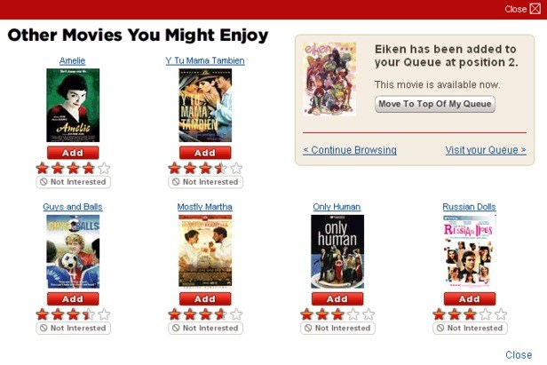

## Portfolio

---
## [Bigmart Product Sales Prediction](https://anirbanpaldsc.github.io/Bigmart-Product-Sales-Prediction/)

 This project relates to retail domain and basically is a machine learning model to find out factors significant for product sales.
 
#### [Repository Link](https://github.com/anirbanpalDSC/Bigmart-Product-Sales-Prediction)
   
---
## [Hotel Recommendation](https://anirbanpaldsc.github.io/Hotel-Recommendation/)

All online travel agencies are scrambling to meet the Artificial Intelligence driven personalization standard set by Amazon and Netflix. In addition, the world of online travel has become a highly competitive space where brands try to capture our attention (and wallet) with recommending, comparing, matching, and sharing. For this assignment, we aim to create the optimal hotel recommendations for Expedia’s users that are searching for a hotel to book. For this assignment, you need to predict which “hotel cluster” the user is likely to book, given his (or her) search details.
#### [Repository Link](https://github.com/anirbanpalDSC/Hotel-Recommendation)
    
---
## [Data Visualization](https://anirbanpaldsc.github.io/Data-Visualizations/)

This project has sample of creating various charts in both R and Python. For R, the intention is to ultimately create an R package and parameterize those various chart types for ease of use.
 
#### [Repository Link](https://github.com/anirbanpalDSC/Data-Visualizations/)
   
---
## [LA Bike Share Model](https://anirbanpaldsc.github.io/LA-Bike-Share-Predictive-Model-DSC630/)

#### [Repository Link](https://github.com/anirbanpalDSC/LA-Bike-Share-Predictive-Model-DSC630/)
 
---

## [Movie Recomendation Engine](https://anirbanpaldsc.github.io/Movie-Recommendation-Engine/)

This is a recommendation engine that suggests movies to an user, based on the selections the user has done before.

#### [Repository Link](https://github.com/anirbanpalDSC/Movie-Recommendation-Engine)
   
---
## [Flight Delay Prediction](https://anirbanpaldsc.github.io/Flight-Delay-Prediction/)

A machine learning model that predicts the status of a flight (delay/on-time) based on supervised learning using past flight, airport and weather informatrion.
 
#### [Repository Link](https://github.com/anirbanpalDSC/Flight-Delay-Prediction)
   
---
## [R Bullet Chart](https://anirbanpaldsc.github.io/R-Bullet-Chart-using-ggplot/)

 A function that primarily uses `ggplot` package in R to produce bullet chart, which is an important graph type but natively not avialble in any of the graphing packages.
 
#### [Repository Link](https://github.com/anirbanpalDSC/R-Bullet-Chart-using-ggplot)
  
---
## [Neural Network Classifier](https://anirbanpaldsc.github.io/Neural-Network-Classifier/)

This project is a demonstration of Neural Network using Python.
 
#### [Repository Link](https://github.com/anirbanpalDSC/Neural-Network-Classifier/)
   
---
## [connectR](https://anirbanpaldsc.github.io/connectR/)

#### [Repository Link](https://github.com/anirbanpalDSC/connectR/)
---
## [Exploratory-Data-Analysis](https://anirbanpaldsc.github.io/Exploratory-Data-Analysis-DSC530/)

#### [Repository Link](https://github.com/anirbanpalDSC/Exploratory-Data-Analysis-DSC530/)

---
<!-- Remove above link if you don't want to attibute -->
